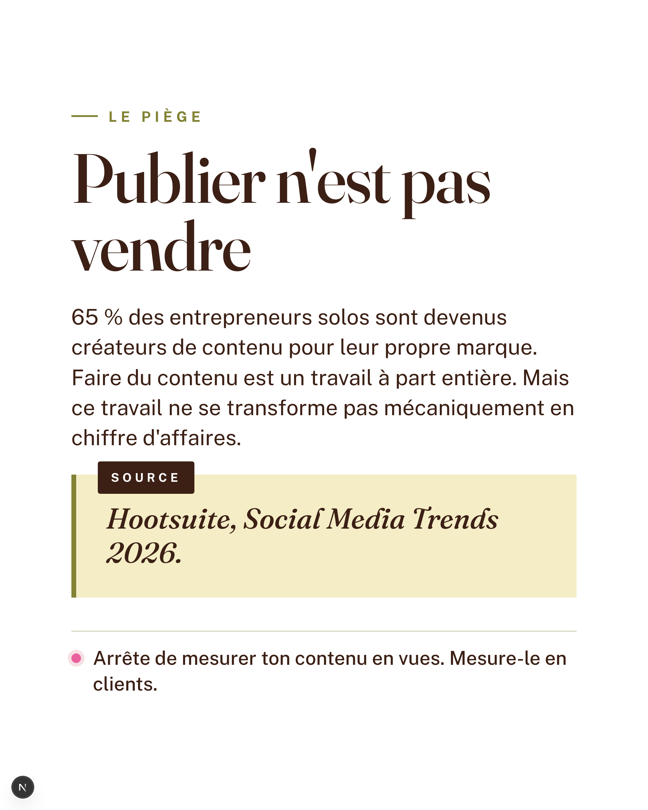
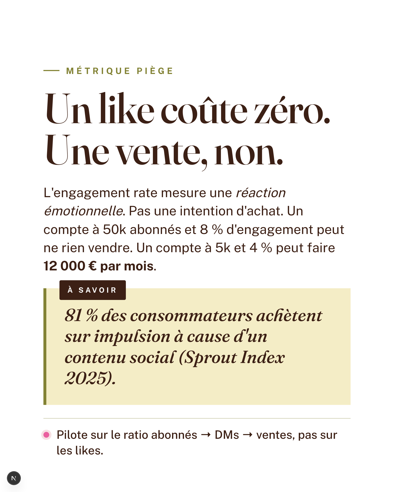
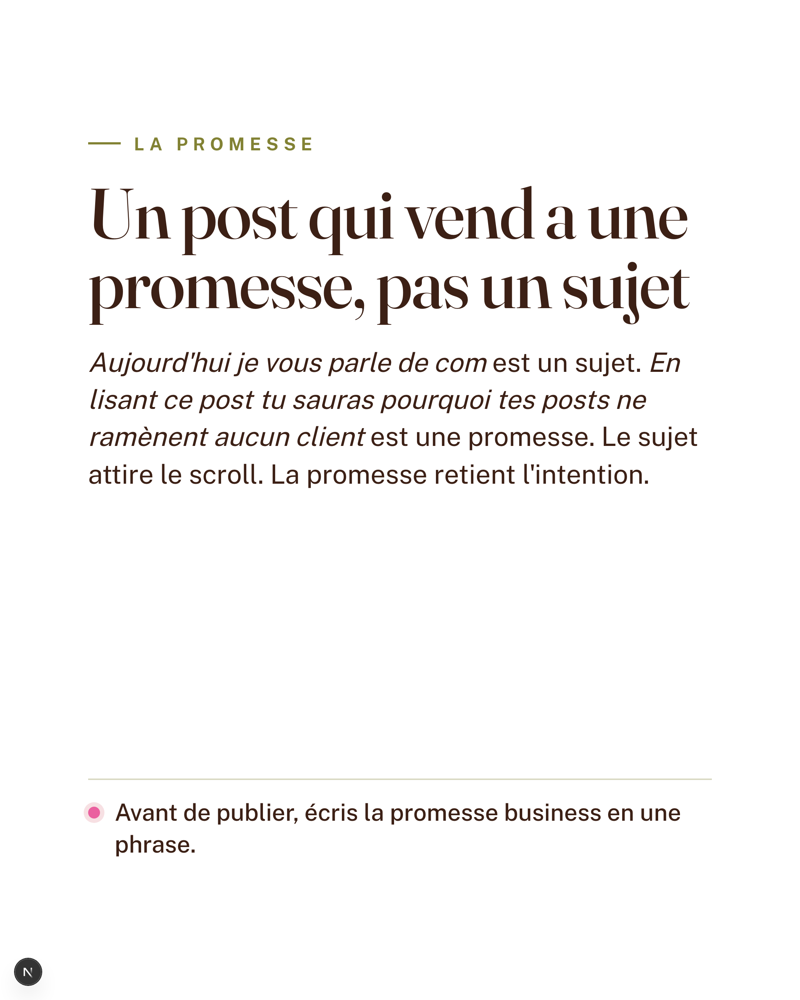
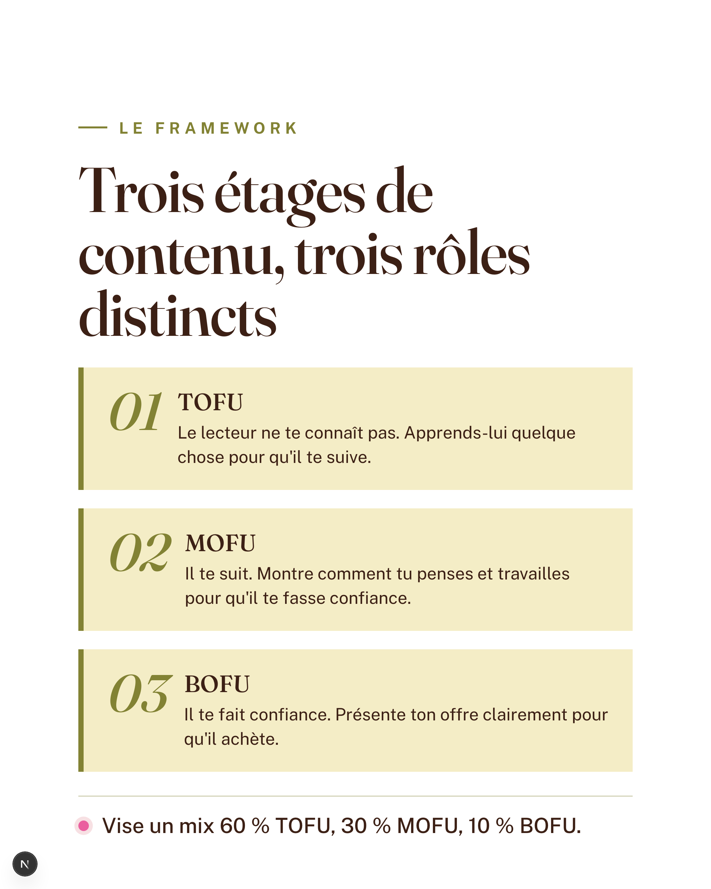
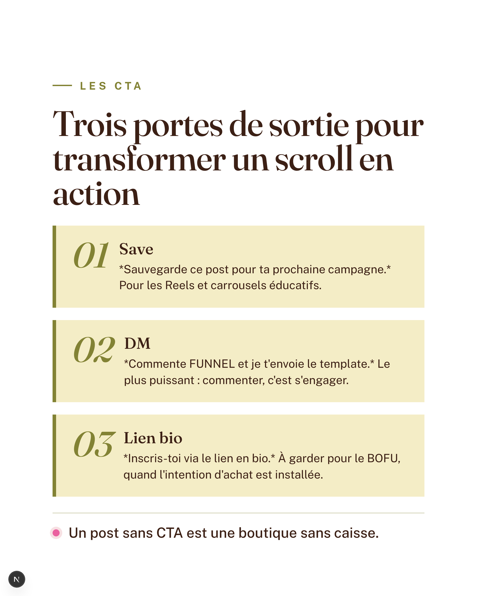
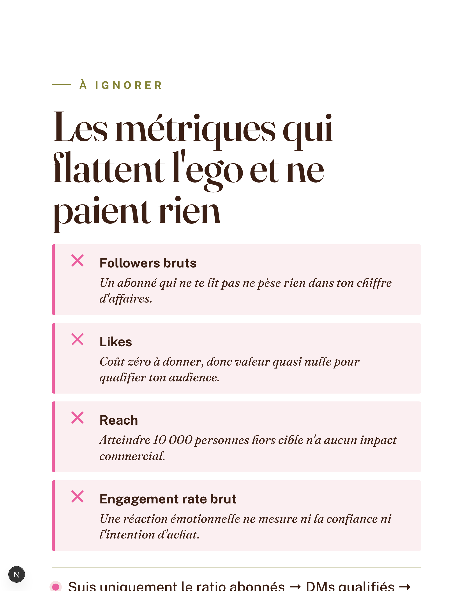

# Carrousel Studio — Aperçu pour Osecom

Outil interne qui transforme tes articles de blog en carrousels Instagram (5 à 12 slides), avec une voix éditoriale cohérente et une charte visuelle dédiée. Une fois l'article lu par Claude, le carrousel est généré en ~45 secondes, éditable inline, et exporté en PNG 1080×1350 prêt à publier.

---

## Comment ça marche en 4 étapes

1. **On a tes articles dans le projet.** 6 articles "Stratégie & Positionnement" sont déjà chargés dans `data/articles-source.json`. On peut en ajouter ou les remplacer à tout moment.
2. **Tu cliques "Générer".** Claude lit l'article, identifie la structure idéale (combien de slides, quel type pour quelle idée), et écrit chaque slide dans la voix Osecom.
3. **Tu ajustes si besoin.** Mode édition inline : clic sur un texte → tu le modifies. Pas de re-génération nécessaire pour des corrections de surface.
4. **Tu exportes.** Bouton "Sauvegarder PNG" → 1 PNG par slide, format Instagram (1080×1350, retina), prêt à uploader.

---

## La voix Osecom (côté texte)

Direct, structuré, didactique, tutoyé. Pose le piège, donne la mécanique, conclus sur l'action. Pas de jargon, pas de superlatifs, pas d'emoji. Phrases courtes. Verbe actif. Une idée par slide, jamais deux.

Marqueurs autorisés : `*mot*` pour italique éditoriale, `**mot**` pour gras (parcimonie : 1 à 2 par slide max).

---

## Charte visuelle

### Palette

| Couleur | Hex | Usage |
|---|---|---|
| Brun foncé | `#3C2015` | Texte principal |
| Olive | `#828234` | Tags, accents secondaires, traits |
| Rose | `#EA609F` | Pastille d'action, points forts |
| Beige doré | `#F4EDC6` | Encarts (méthodes, testbox) |
| Ivoire | `#FFFDF8` | Fond des slides |

### Typographie

- **Fraunces** (serif moderne) — titres principaux, accents éditoriaux en `*italique*`
- **Public Sans** (sans-serif géométrique) — tags MAJUSCULES, body, navigation

---

## Les 6 types de slides

Chaque carrousel pioche dans 6 templates visuels selon la structure de l'article. Claude choisit la séquence ; on peut la réagencer manuellement après.

| # | Type | Rôle | Quand l'utiliser |
|---|---|---|---|
| 1 | **cover** | Slide d'ouverture | Toujours en première position. Hook + sous-titre qui pose la promesse |
| 2 | **body** | Idée explicative | Format de fond du carrousel. Tag + titre + paragraphe + action |
| 3 | **method** | Méthode courte | Framework en 2-3 étapes (encarts beige doré numérotés) |
| 4 | **steps** | Plan d'action | 4-8 étapes séquentielles (liste numérotée compacte) |
| 5 | **donts** | Anti-patterns | 3-5 erreurs à éviter (encarts rose pâle avec croix) |
| 6 | **cta** | Appel à l'action | Toujours en dernière position. Bouton plein olive avec call-to-action |

Règles de séquence :
- Première slide = `cover`, dernière = `cta`
- Au moins 1 slide `body` entre les deux
- Pas de répétition immédiate du même type quand un autre fait mieux

---

## Carrousel exemple — *Comment transformer son contenu en clients*

9 slides, générées à partir de [l'article correspondant](./data/articles-source.json). Voix Osecom respectée, palette en place.

### Slide 01 — Cover

> *Tes posts cartonnent. Ton CA dort.*

### Slide 02 — Body · `LE PIÈGE`

> *Publier n'est pas vendre*

### Slide 03 — Body · `MÉTRIQUE PIÈGE`

> *Un like coûte zéro. Une vente, non.*

### Slide 04 — Body · `LA PROMESSE`

> *Un post qui vend a une promesse, pas un sujet*

### Slide 05 — Method · `LE FRAMEWORK`

> *Trois étages de contenu, trois rôles distincts*

### Slide 06 — Method · `LES CTA`

> *Trois portes de sortie pour transformer un scroll en action*

### Slide 07 — Donts · `À IGNORER`

> *Les métriques qui flattent l'ego et ne paient rien*

### Slide 08 — Body · `PREUVE`

> *Une boutique de bijoux : 200 € à 1 600 € en 90 jours*

### Slide 09 — CTA

> *Audite tes 5 derniers posts maintenant*

---

## Comment réviser et donner ton feedback

Tu as **deux options** selon le niveau du change :

### Option 1 — Modifications de texte (rapide, autonome)

Tu peux éditer chaque slide directement dans l'app. Mode édition activé → clic sur n'importe quel texte → tu corriges. Marqueurs supportés : `*italique*` et `**gras**`. Re-export en PNG en 1 clic.

### Option 2 — Pointer ce qui ne va pas (design, layout, voix)

Pour tout ce qui sort du texte (couleurs, espaces, hiérarchie, photo de fond, choix typographique, ton général d'une slide), envoie :
- **Quelle slide** est concernée (numéro, titre)
- **Ce qui te dérange** précisément (un mot suffit : "trop chargé", "pas assez ferme", "manque de respiration", etc.)
- **Une référence visuelle** si tu as (Pinterest, screenshot d'un autre carrousel que tu kiffes)

Une réponse vague (*"j'aime pas trop"*) coûte 2 allers-retours pour préciser. Une réponse pointue (*"slide 4, le titre fait trop mou — il faudrait plus de punch comme la cover"*) → un seul aller-retour, change qualifié, livré.

---

## Questions courantes

**Combien de carrousels on peut générer ?**
Sans limite. Compter ~45 secondes de génération + ~30 secondes d'export PNG par carrousel.

**Les images de fond (cover, body, CTA), on peut les changer ?**
Oui. L'app a un système de **thèmes** : tu uploades un set de 3 PNG (cover + body + CTA, 1080×1350) et tu choisis ton thème par carrousel. Possible d'avoir plusieurs thèmes en parallèle (saison, campagne, série).

**Si je veux retravailler un texte spécifique sans tout regénérer ?**
Mode édition inline (Option 1 ci-dessus). Tu modifies, tu réexportes. Pas besoin de relancer Claude.

**Si la séquence des slides ne me plaît pas ?**
Aujourd'hui : on peut éditer les textes mais pas réordonner les slides depuis l'UI. Si besoin, on change l'ordre dans le code source du draft (5 minutes côté dev). Évolution prévue : drag-and-drop dans l'éditeur.

**Le projet est sur Vercel, Netlify ?**
Non. L'app tourne en local sur un poste qui a Claude Code installé (raison : on appelle Claude en sous-processus, pas via API, donc pas de clé à gérer). Pour publier ailleurs il faudrait basculer sur l'API Anthropic.

**On peut prévisualiser tous les carrousels d'un coup ?**
Oui — plus de carrousels seront ajoutés à cette doc au fur et à mesure des générations validées.

---

> **Note pour partage** : si tu veux montrer cette doc à quelqu'un sans accès au repo GitHub, exporte-la en PDF (VS Code → "Markdown PDF" ou équivalent) — les images sont embarquées via paths relatifs et seront incluses dans l'export.
